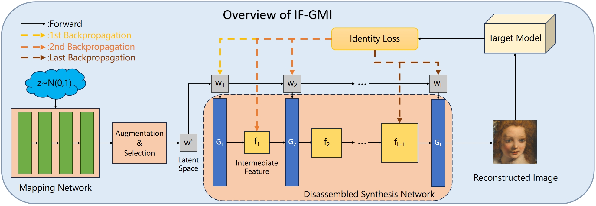

# A Closer Look at GAN Priors: Exploiting Intermediate Features for Enhanced Model Inversion Attacks
[](https://opensource.org/licenses/MIT)


[Yixiang Qiu*](https://scholar.google.cz/citations?hl=zh-CN&user=kxotrxgAAAAJ),
[Hao Fang*](https://scholar.google.cz/citations?user=12237G0AAAAJ&hl=zh-CN),
[Hongyao Yu*](https://scholar.google.cz/citations?user=SpN1xqsAAAAJ&hl=zh-CN),
[Bin Chen#](https://github.com/BinChen2021),
[Meikang Qiu](https://scholar.google.cz/citations?hl=zh-CN&user=smMVdtwAAAAJ),
[Shu-Tao Xia](https://www.sigs.tsinghua.edu.cn/xst/main.htm)

[ECCV-2024 Oral] A PyTorch official implementation for [A Closer Look at GAN Priors: Exploiting Intermediate Features for Enhanced Model Inversion Attacks](https://arxiv.org/abs/2407.13863), accepted to ECCV-2024.



## Visual Results


## Environments
The essential environment for launching attacks can be built up with the following commands:
```sh
git clone https://github.com/final-solution/IF-GMI.git
conda create -n ifgmi python=3.10
conda activate ifgmi
pip install -r requirements.txt
```

## Datasets
Following [PPA](https://github.com/LukasStruppek/Plug-and-Play-Attacks), we support [FaceScrub](http://vintage.winklerbros.net/facescrub.html), [CelebA](https://mmlab.ie.cuhk.edu.hk/projects/CelebA.html) and [Stanford Dogs](http://vision.stanford.edu/aditya86/ImageNetDogs/) as datasets to train the target models. Please place all datasets in the folder ```data``` with the following structure kept:

 .
    ├── data       
        ├── celeba
            ├── img_align_celeba
            ├── identity_CelebA.txt
            ├── list_attr_celeba.txt
            ├── list_bbox_celeba.txt
            ├── list_eval_partition.txt
            ├── list_landmarks_align_celeba.txt
            └── list_landmarks_celeba.txt
        ├── facescrub
            ├── actors
                ├── faces
                └── images
            └── actresses
                ├── faces
                └── images
        ├── stanford_dogs
            ├── Annotation
            ├── Images
            ├── file_list.mat
            ├── test_data.mat
            ├── test_list.mat
            ├── train_data.mat
            └── train_list.mat

For CelebA, please refer to the [HD CelebA Cropper](https://github.com/LynnHo/HD-CelebA-Cropper). We cropped the images with a face factor of 0.65 and resized them to size 224x224 with bicubic interpolation. The other parameters were left at default. Note that we only use the 1,000 identities with the most number of samples out of 10,177 available identities.

