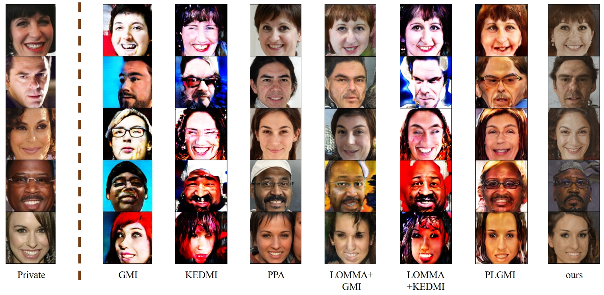

# A Closer Look at GAN Priors: Exploiting Intermediate Features for Enhanced Model Inversion Attacks
[](https://opensource.org/licenses/MIT)


[Yixiang Qiu*](https://scholar.google.cz/citations?hl=zh-CN&user=kxotrxgAAAAJ),
[Hao Fang*](https://scholar.google.cz/citations?user=12237G0AAAAJ&hl=zh-CN),
[Hongyao Yu*](https://scholar.google.cz/citations?user=SpN1xqsAAAAJ&hl=zh-CN),
[Bin Chen#](https://github.com/BinChen2021),
[Meikang Qiu](https://scholar.google.cz/citations?hl=zh-CN&user=smMVdtwAAAAJ),
[Shu-Tao Xia](https://www.sigs.tsinghua.edu.cn/xst/main.htm)

[ECCV-2024 Oral] A PyTorch official implementation for [A Closer Look at GAN Priors: Exploiting Intermediate Features for Enhanced Model Inversion Attacks](https://arxiv.org/abs/2407.13863), accepted to ECCV-2024.


> *Abstract*: Model Inversion (MI) attacks aim to reconstruct privacy-sensitive training data from released models by utilizing output information, raising extensive concerns about the security of Deep Neural Networks (DNNs). Recent advances in generative adversarial networks (GANs) have contributed significantly to the improved performance of MI attacks due to their powerful ability to generate realistic images with high fidelity and appropriate semantics. However, previous MI attacks have solely disclosed private information in the latent space of GAN priors, limiting their semantic extraction and transferability across multiple target models and datasets. To address this challenge, we propose a novel method, **I**ntermediate **F**eatures enhanced **G**enerative **M**odel **I**nversion (**IF-GMI**), which disassembles the GAN structure and exploits features between intermediate blocks. This allows us to extend the optimization space from latent code to intermediate features with enhanced expressive capabilities. To prevent GAN priors from generating unrealistic images, we apply a $l_1$ ball constraint to the optimization process. Experiments on multiple benchmarks demonstrate that our method significantly outperforms previous approaches and achieves state-of-the-art results under various settings, especially in the out-of-distribution (OOD) scenario.
## Visual Results



## Environments
The essential environment for launching attacks can be built up with the following commands:
```sh
git clone https://github.com/final-solution/IF-GMI.git
conda create -n ifgmi python=3.10
conda activate ifgmi
pip install -r requirements.txt
```

## Datasets
Following [PPA](https://github.com/LukasStruppek/Plug-and-Play-Attacks), we support [FaceScrub](http://vintage.winklerbros.net/facescrub.html), [CelebA](https://mmlab.ie.cuhk.edu.hk/projects/CelebA.html) and [Stanford Dogs](http://vision.stanford.edu/aditya86/ImageNetDogs/) as datasets to train the target models. Please place all the datasets in the folder ```data``` with the following structure kept:

    .
    ├── data       
        ├── celeba
            ├── img_align_celeba
            ├── identity_CelebA.txt
            ├── list_attr_celeba.txt
            ├── list_bbox_celeba.txt
            ├── list_eval_partition.txt
            ├── list_landmarks_align_celeba.txt
            └── list_landmarks_celeba.txt
        ├── facescrub
            ├── actors
                ├── faces
                └── images
            └── actresses
                ├── faces
                └── images
        ├── stanford_dogs
            ├── Annotation
            ├── Images
            ├── file_list.mat
            ├── test_data.mat
            ├── test_list.mat
            ├── train_data.mat
            └── train_list.mat

For CelebA, please refer to the [HD CelebA Cropper](https://github.com/LynnHo/HD-CelebA-Cropper). We cropped the images with a face factor of 0.65 and resized them to size 224x224 with bicubic interpolation. The other parameters were left at default. Note that we only use the 1,000 identities with the most number of samples out of 10,177 available identities.

## Target Models
The target models utilized in our paper are identical to the models provided in [PPA](https://github.com/LukasStruppek/Plug-and-Play-Attacks/releases). Download the target models and place them in the folder ```pretrained```. To evaluate on the ```ResNeSt``` models, you might clone the related code from [ResNeSt](https://github.com/zhanghang1989/ResNeSt) and place it in the root folder ```IF-GMI/```.

Additionally, our code retains the training configuration file and training code. Therefore, you may follow the same instructions in the [PPA](https://github.com/LukasStruppek/Plug-and-Play-Attacks) to train your own models.

## StyleGAN2
The code for StyleGAN2 structure is built-in and adjusted to support intermediate features optimization in the folder ```stylegan2_intermediate```. However, the weights for pre-trained StyleGAN2 require downloaded manually. The pre-trained weights can be copied from the official repository [StyleGAN2](https://github.com/NVlabs/stylegan2-ada-pytorch) or downloaded manually as follows:
```sh
wget https://nvlabs-fi-cdn.nvidia.com/stylegan2-ada-pytorch/pretrained/ffhq.pkl -P stylegan2_intermediate/
```
NVIDIA provides the following pre-trained models: ```ffhq.pkl, metfaces.pkl, afhqcat.pkl, afhqdog.pkl, afhqwild.pkl, cifar10.pkl, brecahad.pkl```. You may customize the link to download other pre-trained weights. 

Notably, it's necessary to extract the parameters from the ```.pkl``` model weights using the ```pkl2pth.py``` file, which outputs a ```.pth``` file. This is because the ```.pkl``` contains the whole structure of StyleGAN2, while we customize the StyleGAN2 structure to support intermediate features optimization, thus merely requiring the parameters. Also, you may directly download the extracted parameters from our released [link](https://github.com/final-solution/IF-GMI/releases).

## Quickly Start
We prepare an example configuration file in the ```configs/example.yaml```. To perform our attacks, run the following command with the specified configuration file:
```sh
python intermediate_attack.py -c=configs/example.yaml
```
We also provide configurations utilized in our main experiments, which are placed under the ```configs/``` folder. All the attack results will be stored at the ```result_path``` specified in the configuration ```xxx.yaml```.

## Baselines
To conveniently perform comparison and evaluation on baselines, our team has built a comprehensive toolbox for Model Inversion Attacks and Defenses. We recommend utilizing the [toolbox](https://github.com/ffhibnese/Model-Inversion-Attack-ToolBox) to reproduce the results presented in our paper and conduct other essential experiments!

## Citation
**If you are interested in our work, please kindly cite our paper:**
```
@article{qiu2024closer,
  title={A Closer Look at GAN Priors: Exploiting Intermediate Features for Enhanced Model Inversion Attacks},
  author={Qiu, Yixiang and Fang, Hao and Yu, Hongyao and Chen, Bin and Qiu, MeiKang and Xia, Shu-Tao},
  journal={arXiv preprint arXiv:2407.13863},
  year={2024}
}

@article{fang2024privacy,
  title={Privacy leakage on dnns: A survey of model inversion attacks and defenses},
  author={Fang, Hao and Qiu, Yixiang and Yu, Hongyao and Yu, Wenbo and Kong, Jiawei and Chong, Baoli and Chen, Bin and Wang, Xuan and Xia, Shu-Tao},
  journal={arXiv preprint arXiv:2402.04013},
  year={2024}
}
```

## Acknowledgement
Our code is based on [PPA](https://github.com/LukasStruppek/Plug-and-Play-Attacks). For StyleGAN2, we adapt this [Pytorch implementation](https://github.com/NVlabs/stylegan2-ada-pytorch). We express sincere gratitude for the authors who provide high-quality codes for datasets, metrics and trained models. It's their great devotion that contributes to the prosperous community of **MIA**!
